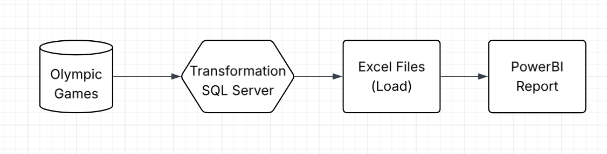
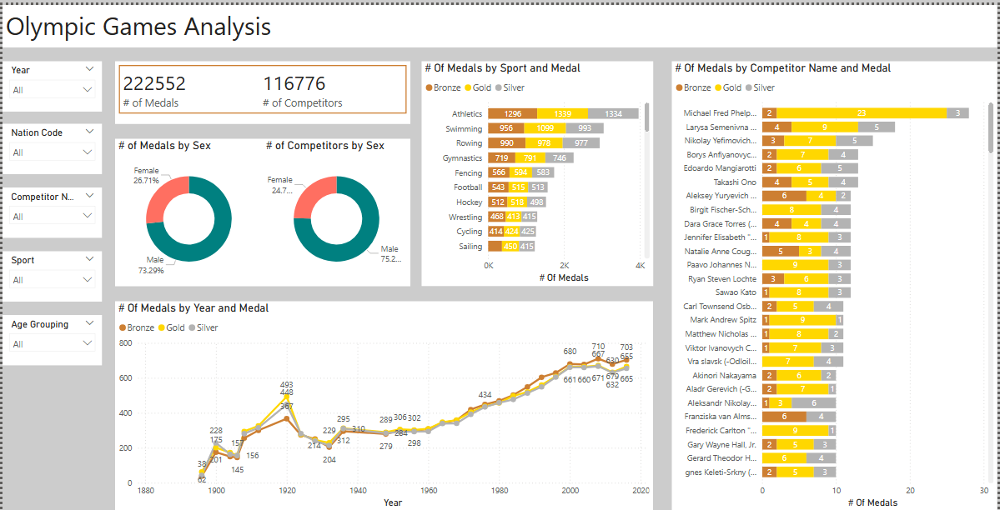

# Olympic Games Analysis - Power BI Dashboard

##  Project Overview

The Olympic Games Analysis project aims to transform raw historical Olympic data into a compelling and interactive dashboard using Power BI. The primary objective is to uncover trends, patterns, and insights related to medal distributions, and sports performance across different Olympic years. By visualizing the data through multiple lenses such as gender, sport, medal type, and individual competitors, the dashboard provides stakeholders with a clear and actionable understanding of how the Olympic Games have evolved over time. 
This solution supports:
- Strategic decision-making for sports organizations.
- Gender equality assessment in athlete participation.
- Number of medals obtained against competitors and sport types.
- Historical analysis of medal trends across decades

The project integrates data cleaning, measure creation, and visual storytelling to deliver a professional grade report suitable for both analytical and executive audiences. Here you can see the detailed project overview:


## Business Requirements
The goal of this report is to help business stakeholders:

- Track sales performance across products, cities, and customers.
- Monitor how sales compare to targets (budget).
- Analyze growth and decline in sales versus the previous year (YoY).
- Identify top-performing customers and regions.
Detailed Requirements are mention in file 
The International Olympic Committee and associated stakeholders require actionable insights into Olympic performance trends to better understand:

- Gender participation over the decades
- Medal distribution by country, sport, and competitor
- Historic performance trends and emerging patterns

The goal is to create a comprehensive and interactive dashboard that enables users to explore Olympic data from multiple dimensions such as gender, medals, year, sport, and individual athletes.

## Enviorenment or Tools
SQL, Docker, MS SQL Server, Dbeaver, Excel Files, PBI, Github.

## Data Source & Processing

- The dataset was .bak file on a website downloaded from there and restored in MS SQL Server through docker and it includes many tables like:
  - Olympic information
- Data cleaning, transformation was done in dbeaver and files are placed in code/ folder.

## 📁 Files in this Repository

| File Name | Description |
|-----------|-------------|
| `Olymic_Report.pbix` | Main Power BI dashboard file |
| `README.md` | Project description |
| `images/` | Folders containing images of dashboard and model |
| `Code/` | Folder containing transformations performed for cleaning data to get it ready for reports |
| `data/` | Folder containing data files exported after transformations to upload in PBI |
| `Business Problem.ppt` | Document including all business requirements to make report |
| `Model.png` | Image involves overall project architecture overview |
## 🧩 Dashboard Features

### **Analysis Report**

This page provides a high-level summary of overall sales metrics, budget comparisons, and monthly trends.

- Total number of medals
- Number of competitors
- Gender wise number of competitors and number of medals (donut charts)
- Yearly medal trends with line
- Number of medals by sport and competitors.



## 🧠 Key DAX Measures

Here are some of the core DAX measures used in the dashboard:

### Number of competitors
```DAX
# of Competitors = 
DISTINCTCOUNT( 'Data'[ID] )
```
### Number of Medals
```DAX
# of Medals = 
COUNTROWS( 'Data' )
```
### Cleaned number of medals excluding nulls
```DAX
# Of Medals (Registered) = 
CALCULATE(
    [# of Medals],
    FILTER(
        'Data',
        'Data'[Medal] = "Bronze"
            || 'Data' [Medal] = "Gold"
            || 'Data'[Medal] = "Silver"
    )
)
```
## Key Insights
- Medal analysis by Year, Gender, Sport, and Competitor
- Time series trends of medal achievements
- Comparative medal performance across sports
- Gender-based participation breakdown
- Filterable dashboard with slicers (Year, Nation Code, Sport, etc.)

## How to Use
- Clone the repository: git clone https://github.com/MahrukhIftikhar/Olymic_Analysis.git
- Open the Power BI file (Olymic_Report.pbix) using Power BI Desktop.
- Refresh the data source if necessary.
- Use slicers for filters like Year, Nation Code, Sport, Competitor and Age Grouping to explore deeper insights.
